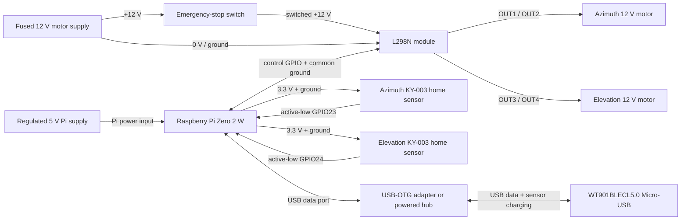
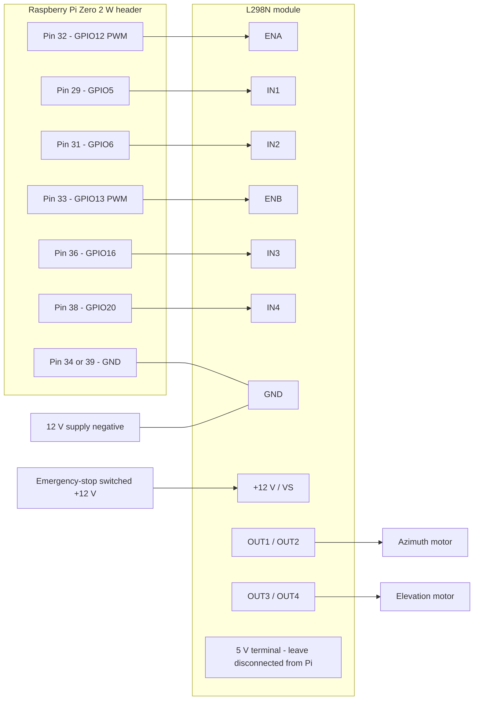
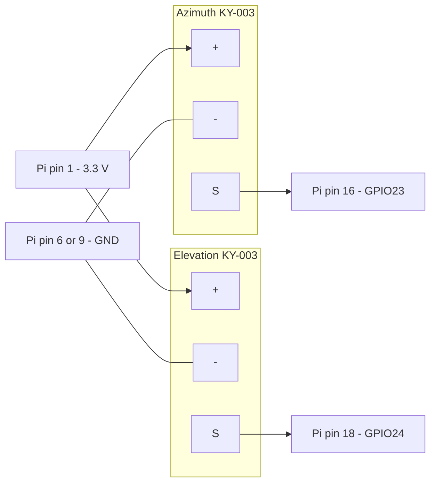
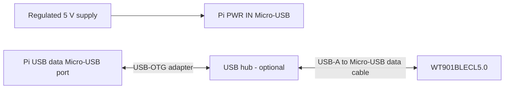

# Wiring diagrams

These diagrams use the Raspberry Pi header's **physical pin numbers** and BCM GPIO names together. Disconnect all power while wiring. Verify every module label with a meter before connecting it to the Pi because clone-board layouts can vary.

## Complete system

Use separate regulated supplies for the Pi and motors. The grounds must be common for the L298N control signals, but **do not connect the L298N module's 5 V terminal to the Pi's 5 V rail**.

## L298N and motors

Remove the L298N module's **ENA and ENB jumper caps** before attaching the PWM wires.

| Pi connection | Physical pin | L298N connection | Purpose |
|---|---:|---|---|
| GPIO12 | 32 | ENA | Azimuth PWM/speed |
| GPIO5 | 29 | IN1 | Azimuth direction |
| GPIO6 | 31 | IN2 | Azimuth direction |
| GPIO13 | 33 | ENB | Elevation PWM/speed |
| GPIO16 | 36 | IN3 | Elevation direction |
| GPIO20 | 38 | IN4 | Elevation direction |
| Ground | 34 or 39 | GND | Common logic/power reference |

Add a 10 kOhm resistor from each of ENA, ENB, IN1, IN2, IN3, and IN4 to ground at the driver end. These pull-downs keep both motors disabled while the Pi boots or is disconnected.

Motor polarity only determines which software direction is positive. If an axis moves backward during the low-power bench test, either swap that motor's two output wires or select the corresponding software inversion setting later—never change wiring while powered.

## KY-003 Hall home sensors

Power both modules from 3.3 V. Pin order varies between KY-003 clones, so follow the module's printed `S`, `+`, and `-` labels rather than assuming their physical order.

Before connecting either `S` wire to the Pi:

1. Power the KY-003 from 3.3 V.
2. Measure `S` to ground with no magnet; it should be approximately 3.3 V.
3. Present the activating magnet pole; `S` should fall below 0.4 V.
4. Confirm `S` never exceeds 3.3 V.
5. Mark the activating magnet face and its matching sensor face.

Add a 0.1 uF ceramic capacitor between `+` and `-` at each module. Route each sensor cable as signal/ground/3.3 V together and keep it away from motor wiring. The firmware treats LOW as home detected and applies debounce.

## WT901BLECL5.0 USB connection

- Use the Pi connector labeled **USB** for data and the connector labeled **PWR IN** for Pi power.
- A direct OTG adapter is suitable if its power budget is adequate. A quality externally powered USB hub is preferable when adding more USB devices; use one designed not to back-feed its upstream port.
- Use a real USB data cable, not a charge-only cable.
- Do not connect the WT901 to Pi GPIO UART pins. The controller communicates only through its USB serial device, normally `/dev/ttyUSB0` or a stable `/dev/serial/by-id/...` path.

## Noise suppression and first-power checks

- Fit an appropriately rated fuse close to the 12 V supply and place the emergency stop in series with motor positive power before the L298N.
- Twist each motor's two wires together and keep them separate from USB and Hall-sensor cables.
- Fit a 0.1 uF ceramic suppression capacitor directly across each motor's terminals.
- Keep the WT901, Hall cables, and USB cable away from motor leads and the L298N heatsink.
- Before attaching motors, verify GPIO control voltages and confirm ENA/ENB remain low during boot.
- For the first powered motion test, use a current-limited motor supply, low PWM, and immediate access to the emergency stop.
